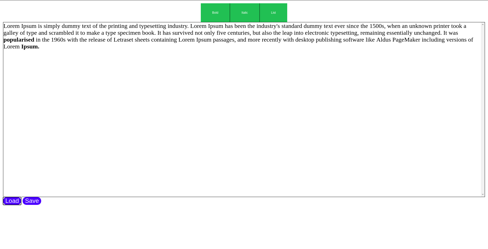
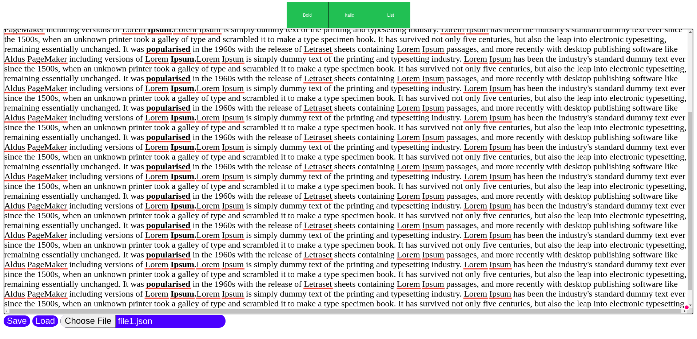

# TextEditor


## This repository contains 2 versions of text editor 

1.  ServerLess version relays more on API connected with Handle FileSystemFileHandle 
   

>More info:
>
 > https://developer.mozilla.org/en-US/docs/Web/API/Window/showOpenFilePicker

1. ServerBased version which is more classic which relays on connection with server.:
  


---

## How to run app
Start with `npm install` in root directory of project

1. Start serverLess:
```
  node index-serverless.js   
```
then go to `http://localhost:3001/` in chrome browser as it works only in chrome and test the app


2. Start ServerBased version:
```
  node index.js   
```

ServerBased version works in folder `text-jsons` , so save files there and work with them from this folder